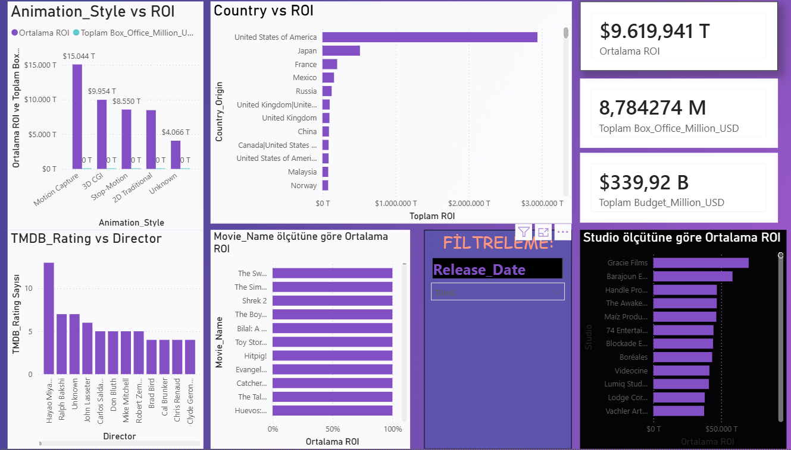

🎬 Animasyon Filmleri Yatırım Analizi & Dashboard
🎬 Animation Movies Investment Analysis & Dashboard
📌 Proje Hakkında
📌 Project Overview

Bu projede, 25.000+ animasyon filmi analiz edilerek yatırım kârlılığı (ROI) incelenmiştir. Amaç, veri analizi ile yüksek getiri sağlayan stratejileri ortaya çıkarmaktır.

This project analyzes 25,000+ animation movies to evaluate investment profitability (ROI) and identify high-return strategies using data analysis.

🎯 İş Problemi
🎯 Business Problem

Film yatırımları yüksek risk içerir ve doğru strateji belirlemek zordur. Bu projede şu sorulara cevap aranmıştır:

Movie investments involve high uncertainty, making strategy decisions difficult. This project answers the following questions:

Hangi film türleri daha yüksek ROI üretir?
Which movie types generate the highest ROI?
Düşük bütçeli filmler daha mı kârlıdır?
Are low-budget films more profitable?
Hangi ülkeler daha başarılı animasyon üretir?
Which countries produce the most successful animations?
Hangi hedef kitle daha yüksek getiri sağlar?
Which target audiences generate higher returns?

🧹 Veri Temizleme
🧹 Data Preparation
Eksik veriler “Unknown” ve 0 ile dolduruldu
Tarih verileri düzenlendi
Sadece bütçe ve gelir bilgisi olan filmlerden df_ticari veri seti oluşturuldu
Missing values handled using “Unknown” and 0
Date features standardized
Created df_ticari dataset including only movies with budget & revenue
📊 Yapılan Analizler
📊 Key Analyses

📅 Yıllara Göre ROI
📅 ROI by Release Year

Bazı yılların daha yüksek ROI ürettiği gözlemlendi. Ancak veri sayısı düşük olan yıllarda sonuçların yanıltıcı olabileceği değerlendirildi.

Certain years show higher ROI, but low sample size may bias results.

🌍 Ülke Analizi
🌍 Country Analysis

Çin ve Kore gibi ülkelerin yüksek ROI ürettiği gözlemlendi. Ancak veri dağılımı dikkate alınmalıdır.

Countries like China and South Korea show strong ROI trends, but results should be interpreted carefully.

🎭 Tür & Hedef Kitle
🎭 Genre & Target Audience

Belirli tür ve hedef kitle kombinasyonlarının daha yüksek getiri sağladığı tespit edildi.

Certain genre and audience combinations outperform others, indicating the importance of positioning.

💸 Bütçe vs Gelir
💸 Budget vs Revenue

Yüksek bütçenin her zaman yüksek kazanç getirmediği görüldü.

Higher budget does not always lead to higher returns.

🚀 Kritik Insight
🚀 Key Insight
🎯 “Düşük Bütçe – Yüksek Getiri”
🎯 “Low Budget – High Return”

Düşük bütçeli filmler doğru strateji ile yüksek ROI sağlayabilir.

Low-budget films can generate high ROI when combined with the right strategy.

👉 Bu durum, bütçeden çok doğru hedefleme ve içerik kalitesinin önemli olduğunu gösterir

👉 This shows that strategy and targeting matter more than budget size

📈 Dashboard
📈 Dashboard

Power BI ile oluşturulan dashboard sayesinde:

ROI, bütçe ve gelir ilişkisi analiz edildi
Tür, ülke ve hedef kitle bazlı filtreleme yapıldı
En kârlı segmentler görselleştirildi

An interactive dashboard built with Power BI allows:

ROI, budget, and revenue analysis
Filtering by country, genre, and audience
Identification of profitable segments

🧠 Sonuç & Öneriler
🧠 Business Recommendations
Düşük ve orta bütçeli projelere odaklanılmalı
Asya pazarları değerlendirilmeli
Tür ve hedef kitle uyumu optimize edilmeli
Yüksek bütçeye gereksiz güvenilmemeli
Focus on low-to-mid budget projects
Consider emerging markets (Asia)
Optimize genre & audience alignment
Avoid assuming high budget guarantees success

🛠️ Kullanılan Teknolojiler
🛠️ Tech Stack
Python (Pandas, Matplotlib, Seaborn)
Jupyter Notebook
Power BI

📌 Not
📌 Note

Bu proje, veri temizleme, analiz ve dashboard oluşturma süreçlerini kapsayan uçtan uca bir veri analizi çalışmasıdır.

This project demonstrates an end-to-end data analysis workflow, from data cleaning to insights and dashboard creation.

## 📷 Dashboard Preview

